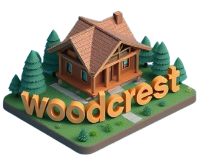

  

  <h1>WoodCrest Hotels - Admin</h1>

  <h3>
    <a href="https://wood-crest.vercel.app/">
      <strong>Live Site</strong>
    </a>
  </h3>

  

<!-- Badges -->

<!-- Brief -->

Welcome to <b>WoodCrest Hotels</b>! This is a hotel management web app, where hotel employees can manage cabins, bookings, and guests. It uses Supabase as the backend and implements advanced React techniques such as React Query.

## Key Features

- User authentication ensures that only hotel employees can access the system.
- Employees can manage their profiles, including uploading avatars and changing passwords.
- The app features a dashboard showing recent stats on bookings, check-ins, and sales.
- Manage cabins with the ability to create, update, or delete cabin records.
- Handle bookings with the ability to check guests in and out, and update booking statuses.
- Real-time updates for cabins and bookings using Supabase.
- Visual statistics with charts displaying sales, occupancy rates, and other important data.
- Fully functional dark mode for a customized user experience.

## Technologies Used

- **React** for the frontend.
- **Supabase** for the database and real-time data updates.
- **React Query** for data fetching and caching.
- **React Router** for navigation.
- **React Hook Form** for efficient form handling.
- **Recharts** for data visualization (charts and stats).
- **Styled Components** for styling the UI, including dark mode.
- **Vite** for development environment and build system.

## What I Learned

This project was a deep dive into several advanced React concepts, including:

- **Authentication and Authorization:** Implementing Supabase to securely manage user roles (hotel employees).
- **Real-time Functionality:** Leveraging Supabase's real-time features for dynamic data updates.
- **State Management and Data Fetching:** Using React Query to efficiently manage the app's data flow.
- **Complex UI Patterns:** Implementing reusable patterns like the Compound Component Pattern and Higher-Order Components (HOC) to create more maintainable and scalable code.
- **Responsive and Adaptive Design:** Building a responsive user interface using Styled Components, making sure it works well on different devices and screen sizes.
- **Dark Mode:** Adding dark mode functionality for a personalized user experience.
- **Data Visualization:** Using Recharts to create meaningful visual representations of hotel statistics.
